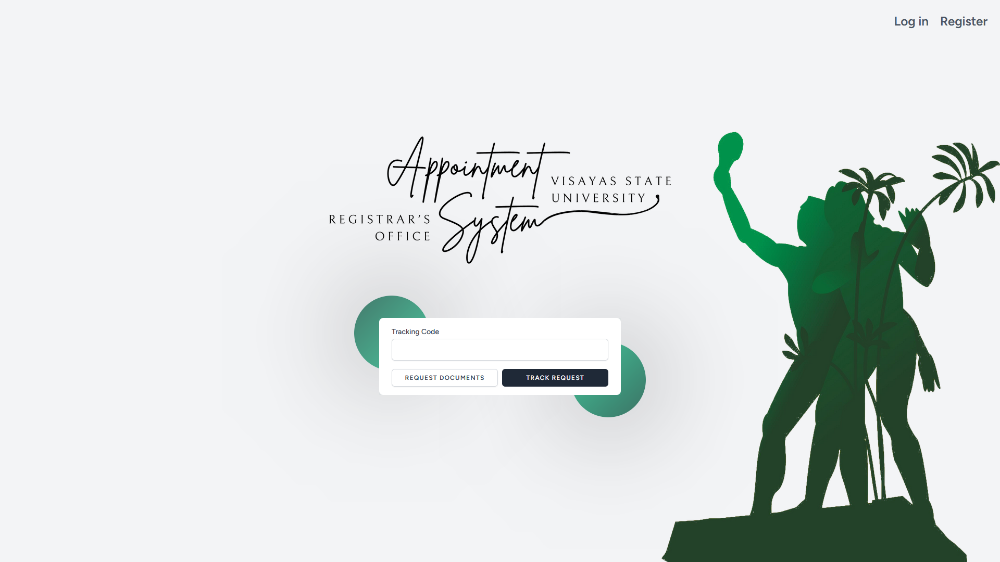

    


## About The System

## Contributing
## Installing Dependencies
- download xampp on https://sourceforge.net/projects/xampp/files/
- on project directory on VS Code run
```php
npm install
composer install
```
## Environmental Variables
  - Copy the `.env.example` file and create the `.env` file on the `VSU-Appointment-System\`
### Setting Up Database
  - Create Database using
    ```php
    php artisan migrate
    ```
  - it will prompt you to create the database if it does not exists
  - run
    ```php
    php artisan db:seed
    ```
  - if you want existing dummy data
  - run
    ```php
    php artisan db:wipe
    ```
  - on xammp import the sql file on `database\sql` make sure you are in the database `vsu-appointment-system`
### Setting Up Mail Mailer Google
  - use your google email on MAIL_USERNAME
  - goto `https://myaccount.google.com/u/1/security?hl=en&utm_source=OGB&utm_medium=act` and make sure that 2-Step Verification is enabled
  - on the search bar type in `app passwords` and create your `MAIL_PASSWORD` on .env make sure to remove the spaces
### Setting Up Paymongo API
  - Reference https://www.youtube.com/watch?v=regzeamhXjI
  - Create a paymongo account on https://www.paymongo.com/
  - on the developers tab will show the keys for
    - `PAYMONGO_SECRET_KEY` and `PAYMONGO_PUBLIC_KEY`
### Setting Up GOOGLE DRIVE API SERVICES
  - Reference https://www.youtube.com/watch?v=WhlIQ2Sv6s8
    - For `GOOGLE_DRIVE_CLIENT_ID`, `GOOGLE_DRIVE_CLIENT_SECRET`, `GOOGLE_DRIVE_REFRESH_TOKEN`, `GOOGLE_DRIVE_FOLDER_ID`
## Run on local device
```php
npm run dev
```
```php
php artisan serve
```
## Run this so that project can be access on other devices in the same network
```php
npm run dev -- --host=IP
```
```php
php artisan serve --host=IP
```
